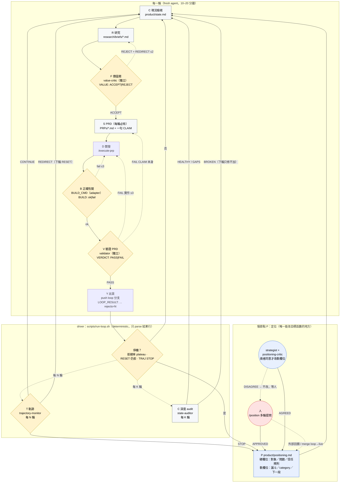

# loop-engineering-on-product — 一條跑不完的產品迴圈

> **TL;DR (EN)** — A reference implementation of an autonomous product loop for Claude Code:
> current-state audit → positioning → research → feature decision → PRD → develop → validate PRD →
> deploy, running as a perpetual graph with two independent gates (value before building,
> validation after), a deterministic driver, and real overnight run data. Copy `.claude/`,
> `scripts/`, `product/`, `research/`, `PRPs/`, `loop.config.env`; write one adapter; run on a `loop` branch. Docs are in
> Traditional Chinese; agent prompts and code are in English.

從一份 PRP（Product Requirement Prompt）骨架開始，跑壞了三次，長成現在這張圖：



讀法：黃色菱形是 gate（判斷交給獨立 agent，結果是一行可 parse 的字串）；灰色方塊是落在 git 裡的產物（每輪 fresh context，狀態全在檔案）；虛線是有上限的回邊（一輪一定在有限時間內結束）；藍色是唯一的慢節點——迴圈沒有終點，停機只是把控制權交回 P，人在就多輪提問收斂，人不在就兩個高階 agent 對抗到一致，都不成就停下來等人。loop 只在隔離分支跑，live 由人 merge。

## 先讀這一份

[`docs/00-pipeline.md`](docs/00-pipeline.md) — 圖的定義：9 個節點（含每 N 輪的 T）各自的產物、gate、失敗回邊、節奏，跑不完的 9 個工程條件，每個節點用什麼原語，driver 唯一讀的結果行協定。其餘文件都是它的展開。

| 文件 | 內容 |
|---|---|
| [01 現況與定位](docs/01-state-and-positioning.md) | C 節點（`product/state.md` 重寫不追加）、P 節點（人拍板的多輪提問，或兩個高階 agent 對抗） |
| [02 研究與價值閘](docs/02-research.md) | `/research` 四角度輪替、`value-critic` 三軸 + 信任閘、ledger 去重 |
| [03 PRD](docs/03-prd.md) | 每輪都有 PRP，size 只決定深度；一句可觀察的 CLAIM |
| [04 建測驗出貨](docs/04-dev-and-validate.md) | `BUILD_CMD` 正確性閘 + 獨立 `validator` 9 軸（含 label-promise） |
| [05 外圈](docs/05-loop.md) | driver、停機條件（拒絕率 plateau）、節奏、成本路由 |
| [06 十條硬教訓](docs/06-lessons.md) | v1 → v2 → v2.1 → v3，含 v2.1 plateau 從未能觸發的 bash 3.2 bug |
| [07 Adapters](docs/07-adapters.md) | web / iOS 兩個現成 adapter + 新場景四問 |
| [08 裝進你的 repo](docs/08-adopt.md) | 五步、驗收清單 |

## 真實實跑

- [`examples/web-v2-20-rounds/`](examples/web-v2-20-rounds/) — v2，web，20 輪過夜：20 出貨、17 個想法被拒、7 類 category、原始 log 與當時的 agent 檔。修出了拒絕率 plateau、信任閘、label-promise 三條。
- [`examples/ios-v1-112-iterations/`](examples/ios-v1-112-iterations/) — v1，iOS，112 輪：沒有價值閘的 loop 長什麼樣。

## 結構

```
.
├── product/
│   ├── positioning.md        # P：硬欄位人專屬、軟欄位可自主微調
│   └── state.md              # C：每次深度 audit 重寫
├── research/
│   ├── TEMPLATE.md           # brief 模板
│   └── briefs/               # R：每輪一份，有來源、一個候選 slice
├── PRPs/
│   ├── templates/prp_base.md # S：PRD 模板（含 Validator CLAIM、Level 4 獨立驗證）
│   └── EXAMPLE_multi_agent_prp.md
├── .claude/
│   ├── commands/             # /audit /position /research /generate-prp /execute-prp /loop-once
│   ├── agents/               # state-auditor · strategist · positioning-critic · value-critic · validator · trajectory-monitor
│   ├── tasks/
│   │   ├── innovation_loop.md    # 一輪的規格（driver 每輪餵給 fresh agent）
│   │   ├── _idea_ledger.md       # 去重帳本：看過的一切
│   │   └── _product_backlog.md   # 通過價值閘的完整規格
│   └── settings.local.json.example   # 複製成 settings.local.json（gitignored）；push 只准 loop 分支
├── scripts/
│   ├── run-loop.sh           # deterministic driver：分支隔離、audit、plateau、trajectory、自主定位、timeout（已修 v2.1 的 bash 3.2 plateau bug，別抄 examples/ 裡的 as-run 版）
│   ├── test-driver.sh        # 用 stub claude 跑 7 個劇本，斷言 driver 的停機與路由
│   ├── install-hooks.sh      # pre-push hook：拒推 DEPLOY_BRANCH
│   └── adapters/             # web-check.mjs · ios-shot.sh
├── loop.config.env           # 唯一要填的設定
├── docs/                     # 00–08
├── examples/                 # 兩個真實 run
└── .github/workflows/        # @claude mention + PR review（可選）
```

## 五分鐘

```bash
git checkout -b loop                    # 永不在 live 分支跑；需要 origin remote、claude CLI、Node ≥18
scripts/install-hooks.sh                # pre-push hook：git 層拒推 live 分支
# 填 loop.config.env：北極星、漏斗、category、DEPLOY_BRANCH、BUILD_CMD（佔位不填，第一次 audit 就 BROKEN）
/audit                                  # 重寫 product/state.md
/position                               # 多輪提問收斂 product/positioning.md
/loop-once                              # 互動跑一輪，看 VALUE / PRP_SCORE / BUILD / VERDICT / LOOP_RESULT
scripts/run-loop.sh 20                  # 過夜；tail -f .loop/loop.log
```

## GitHub Actions（可選）

`claude.yml` 回應 issue／PR 裡的 `@claude`；`claude-code-review.yml` 自動 review PR。兩者都需要 repo secret `CLAUDE_CODE_OAUTH_TOKEN`。它們與 loop 無關，是同一個 repo 的日常協作層。

## License

MIT
