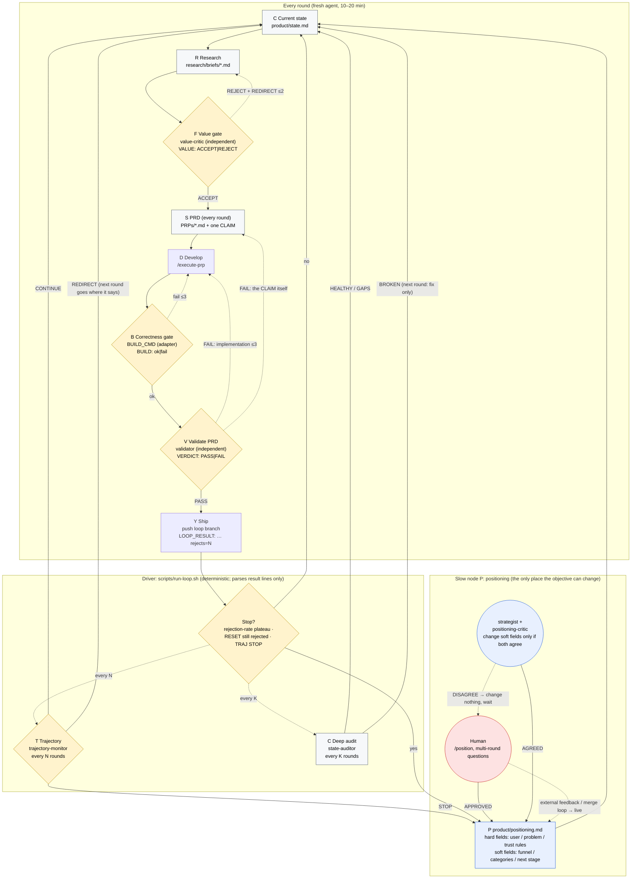
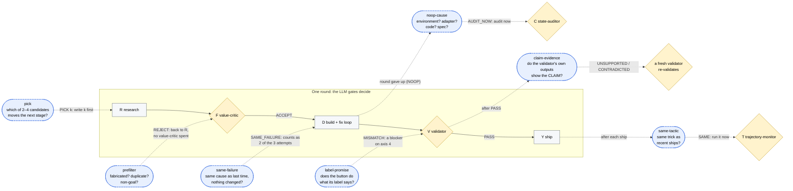
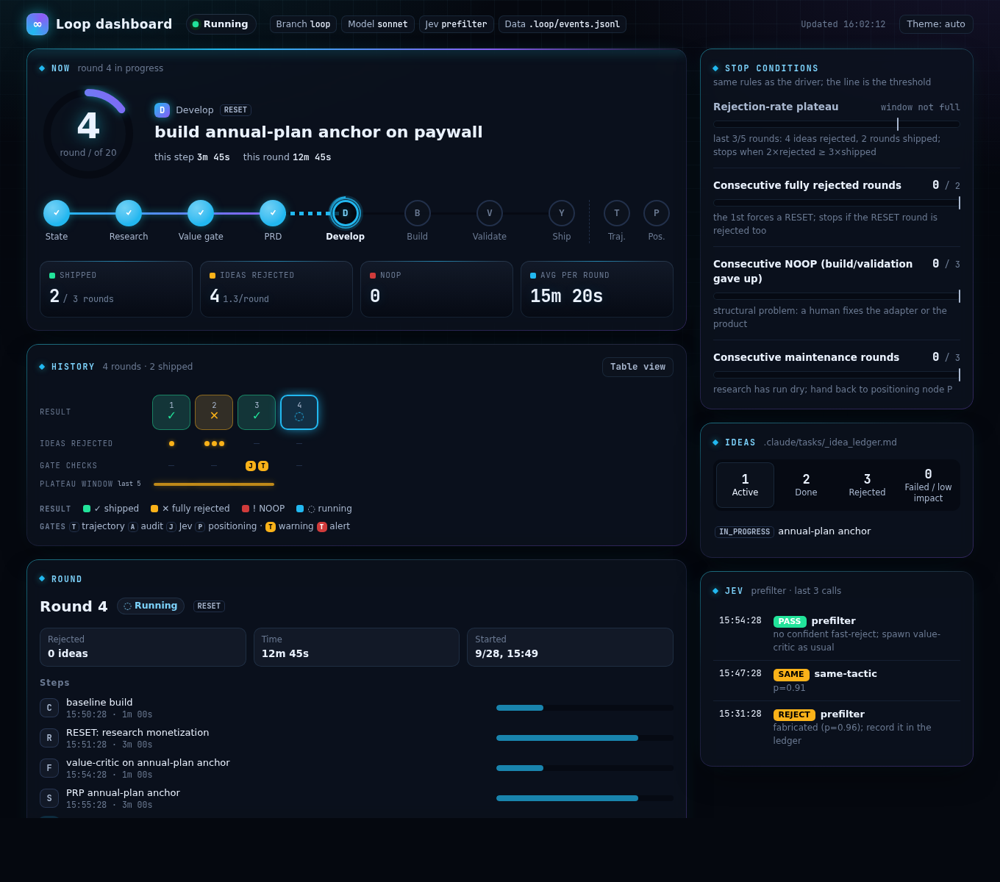

# loop-engineering-on-product

**An autonomous product loop for Claude Code that keeps improving a real product overnight — and knows when to stop and ask.**

Each round, a fresh agent looks at the product as it is today, researches one idea, has it judged for value *before* writing any code, writes a PRD, builds it, has it validated against that PRD by a *different* agent, and pushes it to an isolated branch. A deterministic shell driver runs the rounds, reads one result line per step, and decides when the loop has run out of good ideas. Nothing reaches your live branch unless a human merges it.

It started as a single PRP (Product Requirement Prompt) skeleton, broke three times in real overnight runs, and grew into the graph below. The two real runs are in [`examples/`](examples/), with raw logs.

## The problem it solves

**A loop maximizes whatever its gates measure.** The first version had one gate — "does it build and pass tests?" — and on an iOS health app it spent 31 of 35 overnight rounds adding the same kind of metric. Every round was correct; almost none was worth shipping.

So this loop judges value *before* building and correctness *after*, and neither judgment is made by the agent that did the work:

| | Gate | Who judges | Question |
|---|---|---|---|
| Before building | **F — value gate** | `value-critic` (independent subagent) | Does this plausibly move the north star? Is it new? Is it one small change? Is it honest? |
| After building | **B — correctness gate** | `BUILD_CMD` (your adapter, deterministic) | Does the product still build and render? |
| After building | **V — validation** | `validator` (independent subagent) | Does the product actually do what the PRD's CLAIM promised — including what each button's label promises? |

## How it works


```mermaid
flowchart TB
  classDef gate fill:#fff3cd,stroke:#b58900,color:#000
  classDef slow fill:#e8f0fe,stroke:#1a56db,color:#000
  classDef file fill:#f6f8fa,stroke:#57606a,color:#000
  classDef human fill:#fde2e2,stroke:#c81e1e,color:#000

  subgraph ROUND["Every round (fresh agent, 10–20 min)"]
    direction LR
    C["C Current state<br/>product/state.md"]:::file
    R["R Research<br/>research/briefs/*.md"]:::file
    F{"F Value gate<br/>value-critic (independent)<br/>VALUE: ACCEPT|REJECT"}:::gate
    S["S PRD (every round)<br/>PRPs/*.md + one CLAIM"]:::file
    D["D Develop<br/>/execute-prp"]
    B{"B Correctness gate<br/>BUILD_CMD (adapter)<br/>BUILD: ok|fail"}:::gate
    V{"V Validate PRD<br/>validator (independent)<br/>VERDICT: PASS|FAIL"}:::gate
    Y["Y Ship<br/>push loop branch<br/>LOOP_RESULT: … rejects=N"]
    C --> R --> F
    F -- ACCEPT --> S --> D --> B
    F -. "REJECT + REDIRECT ≤2" .-> R
    B -- ok --> V
    B -. "fail ≤3" .-> D
    V -- PASS --> Y
    V -. "FAIL: implementation ≤3" .-> D
    V -. "FAIL: the CLAIM itself" .-> S
  end

  subgraph DRIVER["Driver: scripts/run-loop.sh (deterministic; parses result lines only)"]
    direction LR
    T{"T Trajectory<br/>trajectory-monitor<br/>every N rounds"}:::gate
    K["C Deep audit<br/>state-auditor<br/>every K rounds"]:::file
    STOP{"Stop?<br/>rejection-rate plateau ·<br/>RESET still rejected · TRAJ STOP"}:::gate
  end

  subgraph SLOW["Slow node P: positioning (the only place the objective can change)"]
    direction LR
    P["P product/positioning.md<br/>hard fields: user / problem / trust rules<br/>soft fields: funnel / categories / next stage"]:::slow
    H(("Human<br/>/position, multi-round questions")):::human
    A(("strategist +<br/>positioning-critic<br/>change soft fields only if both agree")):::slow
  end

  Y --> STOP
  STOP -- no --> C
  STOP -. every N .-> T
  STOP -. every K .-> K
  T -- CONTINUE --> C
  T -- "REDIRECT (next round goes where it says)" --> C
  T -- STOP --> P
  K -- HEALTHY / GAPS --> C
  K -- "BROKEN (next round: fix only)" --> C
  STOP -- yes --> P
  H -- APPROVED --> P
  A -- AGREED --> P
  A -. "DISAGREE → change nothing, wait" .-> H
  P --> C
  H -. "external feedback / merge loop → live" .-> P
```

How to read it: yellow diamonds are **gates** — each judgment goes to an independent agent and comes back as one parseable line. Grey boxes are **artifacts in git** — every round starts with a fresh context, so all state lives in files. Dotted lines are **capped back-edges** — every round ends in bounded time. Blue is the one **slow node**: the loop has no end; "stopping" means handing control back to positioning (P). If a human is around, P converges through multi-round questions; if not, two senior agents argue until they agree; if they cannot, the loop stops and waits. The loop only ever runs on an isolated branch; a human merges to live.

## Key design choices

- **Two independent gates, placed on either side of the build.** Value is judged before any code exists; correctness and promise-keeping are judged after, against the PRD, by an agent that did not write the code.
- **A dumb driver.** `scripts/run-loop.sh` never reasons. It parses one line per node (`VALUE:`, `VERDICT:`, `LOOP_RESULT: … rejects=N`) and applies numeric rules. That is what makes it safe to run overnight, resumable, auditable — and testable with a stub (`scripts/test-driver.sh`, 15 scenarios).
- **Stop on the rejection rate, and hand off instead of ending.** When the value gate rejects more than ~1.5 ideas per idea shipped over a rolling window, the direction is exhausted; control goes to positioning, not to "done".
- **Discover before building.** Every round starts from `product/state.md` and the running product, not from the previous round's notes.
- **Positioning has hard and soft fields.** Target user, problem, and trust rules change only with a human. Funnel emphasis and the next stage to push can be changed overnight, and only when two senior agents independently agree.
- **Trust rules are a hard gate.** On a trust product, an idea that relies on fabricated signals (fake counts, fake popularity, invented testimonials) is rejected no matter how well it would convert.
- **Branch isolation is non-negotiable.** The driver refuses to run anywhere but the loop branch, re-checks every round, and a `pre-push` hook refuses the live branch at the git level (the driver refuses to start without it). The hook is a local backstop — protect the live branch on the remote as well.
- **Every gate decision is recorded.** With `jq` installed, each gate's full report, verdict, and the evidence it gathered are appended to `.loop/gates.jsonl` — a cross-run dataset for calibrating the gates.
- **Optional: cheap fast-rejects that can never approve.** With `JEV_MODE=prefilter`, [TypeSafe's Jev](https://docs.typesafe.ai) — a model that returns typed yes/no and pick answers instead of text, in about 0.2 s — can fast-reject obvious bad ideas (fabricated signals, duplicates, non-goals) and flag broken label promises before an LLM gate spends a subagent on them. It can never approve anything: every pass still goes through the LLM gate. Rollout is off → shadow → prefilter, gated by an offline eval.
- **Optional: watch it live.** `node scripts/dashboard/serve.mjs` serves a local, read-only page: run history, which node the current round is at, and how far each stop condition is from firing.

## What Jev can do

[Jev](https://docs.typesafe.ai) is a cheap, fast judgment model — about 0.2 s and roughly $0.02 per thousand calls. It only answers narrow typed questions (yes/no, pick one) and never sees the code. So the framework gives it one hard rule: **Jev can only block or trigger, never approve.** What passes is always decided by the full LLM gates — value-critic, validator, trajectory-monitor, state-auditor.

It has seven checkpoints in the loop, each with its own question and one possible effect:


```mermaid
flowchart LR
  classDef llm fill:#fff3cd,stroke:#b58900,color:#000
  classDef jev fill:#e8f0fe,stroke:#1a56db,color:#000,stroke-dasharray:4 3
  classDef step fill:#f6f8fa,stroke:#57606a,color:#000

  subgraph ROUND["One round: the LLM gates decide"]
    direction LR
    R["R research"]
    F{"F value-critic"}
    D["D build + fix loop"]
    V{"V validator"}
    Y["Y ship"]
    R --> F -- ACCEPT --> D --> V -- PASS --> Y
  end
  T{"T trajectory-monitor"}
  A{"C state-auditor"}
  RV{"a fresh validator<br/>re-validates"}

  J1(["pick<br/>which of 2–4 candidates<br/>moves the next stage?"])
  J2(["prefilter<br/>fabricated? duplicate?<br/>non-goal?"])
  J3(["same-failure<br/>same cause as last time,<br/>nothing changed?"])
  J4(["label-promise<br/>does the button do<br/>what its label says?"])
  J5(["claim-evidence<br/>do the validator's own outputs<br/>show the CLAIM?"])
  J6(["same-tactic<br/>same trick as<br/>recent ships?"])
  J7(["noop-cause<br/>environment? adapter?<br/>code? spec?"])

  J1 -. "PICK k: write k first" .-> R
  J2 -. "REJECT: back to R,<br/>no value-critic spent" .-> F
  J3 -. "SAME_FAILURE: counts as<br/>2 of the 3 attempts" .-> D
  J4 -. "MISMATCH: a blocker<br/>on axis 4" .-> V
  V -. "after PASS" .-> J5
  J5 -. "UNSUPPORTED / CONTRADICTED" .-> RV
  Y -. "after each ship" .-> J6
  J6 -. "SAME: run it now" .-> T
  D -. "round gave up (NOOP)" .-> J7
  J7 -. "AUDIT_NOW: audit now" .-> A

  class F,V,T,A,RV llm
  class J1,J2,J3,J4,J5,J6,J7 jev
  class R,D,Y step
```

| Checkpoint | What Jev is asked | What it can do |
|---|---|---|
| **pick** — research | Which of 2–4 candidate ideas most likely moves the next stage? | `PICK <key>`: write that one first — it still has to pass value-critic |
| **prefilter** — before value-critic | Does the idea rely on fabricated data, duplicate something already seen, or hit a non-goal? | `REJECT`: sent back to research, saving a value-critic run |
| **same-failure** — fix loops | Is this failure the same cause as the last one, with nothing materially changed? | `SAME_FAILURE`: this failure counts as two of the loop's three attempts |
| **label-promise** — inside the validator | Does the observed behavior deliver what the button's label promises? | `MISMATCH`: listed as a blocker |
| **claim-evidence** — after a validator PASS | Do the commands and outputs the validator actually ran show the PRD's CLAIM holding? | `UNSUPPORTED` / `CONTRADICTED`: a fresh validator re-validates, and its verdict decides |
| **same-tactic** — after each ship | Is the newest commit the same trick as the last few? | `SAME`: run the trajectory check now instead of waiting |
| **noop-cause** — after a round gives up | Is the cause the environment, the adapter, the code, or the spec? | `AUDIT_NOW`: environment or adapter trouble → run the deep state audit now |

Every checkpoint can also answer with one of three outcomes that **do nothing**, so the LLM gate decides exactly as it would without Jev:

- **`PASS`** — "not confident enough to block". This is not an approval.
- **`ESCALATE`** — Jev itself is unsure.
- **`UNAVAILABLE`** — no answer in time (15 s timeout). The only cost is the wait.

With `JEV_MODE=shadow` every answer is only a `SHADOW` line: logged, never acted on, so you can measure how often Jev would have been right before letting it block. In the first live `prefilter` run (12 rounds, about ten calls), Jev blocked or triggered nothing: mostly `PASS` and `DISTINCT`, one `ESCALATE`, two timeouts. Rollout order, safety rules and the evidence behind each checkpoint: [`docs/09-jev.md`](docs/09-jev.md).

## Watch it run

`node scripts/dashboard/serve.mjs` opens a local, read-only dashboard at http://127.0.0.1:4400. It reads only the files the loop already writes and never steers it.



- **Now:** the round, the node on C→R→F→S→D→B→V→Y it has reached, and how long the step and the round have taken.
- **History:** each round's result, with the number of ideas rejected inside it the gate events (T / A / J / P), and the rounds inside the plateau window, each on its own labelled row.
- **Stop conditions:** how far each of the driver's four stop thresholds is from firing, computed with the same rules as `scripts/run-loop.sh`.
- **Ideas and Jev:** every idea in the ledger with its status, and the latest Jev calls.

Past runs can be replayed from their `loop.log`. See [`docs/10-dashboard.md`](docs/10-dashboard.md).

## Evidence from real runs

| Run | Setting | Rounds | What happened | What it changed |
|---|---|---|---|---|
| [v2, web](examples/web-v2-20-rounds/) | single-file fortune-telling site | 20 overnight (4h10m) | 20 shipped, 17 ideas rejected by the value gate, 7 categories, trajectory 4× CONTINUE, live branch never touched | plateau on rejection rate, the trust gate, the label-promise axis |
| [v1, iOS](examples/ios-v1-112-iterations/) | asset-tracking app | 112 | high output, self-approved, pushed to main | the contrast: what a loop without a value gate looks like |

[`docs/06-lessons.md`](docs/06-lessons.md) has the ten lessons behind the design, with numbers — including a bash 3.2 bug that meant the v2.1 plateau could never fire, found only by testing the driver with a stub.

## Quick start

Requirements: a product that builds, an `origin` remote, the `claude` CLI, Node ≥ 18. Optional: `jq` (gate recording); a TypeSafe, OpenRouter or AI Gateway API key (Jev pre-checks).

```bash
git checkout -b loop                    # never run on your live branch
scripts/install-hooks.sh                # pre-push hook: refuses the live branch at the git level
# fill in loop.config.env: north star, funnel, categories, DEPLOY_BRANCH, BUILD_CMD
#   (unfilled placeholders make the first audit report BROKEN)
/audit                                  # rewrite product/state.md
/position                               # converge product/positioning.md through multi-round questions
/loop-once                              # one interactive round: watch VALUE / PRP_SCORE / BUILD / VERDICT / LOOP_RESULT
scripts/run-loop.sh 20                  # overnight; tail -f .loop/loop.log
```

In the morning: read `.loop/loop.log`, review the loop branch's commits one by one, and merge what you want. Full installation guide with an acceptance checklist: [`docs/08-adopt.md`](docs/08-adopt.md).

Optional Jev pre-checks — follow the rollout order in [`docs/09-jev.md`](docs/09-jev.md):

```bash
(cd scripts/jev && npm ci) && export TYPESAFE_API_KEY=...          # environment only, never loop.config.env
JEV_MODE=prefilter node scripts/jev/eval-backlog.mjs              # 1. offline eval on a past run: JEV_EVAL: SAFE?
JEV_MODE=shadow scripts/run-loop.sh 20                            # 2. one night where Jev is asked but never obeyed
node scripts/jev/shadow-report.mjs                                # 3. false rejects vs value-critic: JEV_SHADOW: SAFE?
JEV_MODE=prefilter scripts/run-loop.sh 20                         # 4. only if both came back SAFE
```

Watch a run: `node scripts/dashboard/serve.mjs`, then open http://127.0.0.1:4400.

## Documentation

Start with [`docs/00-pipeline.md`](docs/00-pipeline.md): it defines the graph — the nine nodes (including T every N rounds), each one's artifact, gate, failure back-edges and cadence, the nine engineering conditions for a loop that never ends, the primitive behind each node, and the result-line protocol the driver reads. Everything else expands on it.

| Doc | Covers |
|---|---|
| [01 Current state and positioning](docs/01-state-and-positioning.md) | Node C (`product/state.md`, rewritten not appended) and node P (a human converging through questions, or two senior agents arguing) |
| [02 Research and the value gate](docs/02-research.md) | `/research` rotating four angles, `value-critic`'s three axes + trust gate, ledger dedup |
| [03 PRD](docs/03-prd.md) | A PRP every round, depth set by size; one observable CLAIM |
| [04 Build, test, validate, ship](docs/04-dev-and-validate.md) | The `BUILD_CMD` correctness gate + the independent `validator`'s 9 axes (including label-promise) |
| [05 The outer loop](docs/05-loop.md) | The driver, stop conditions (rejection-rate plateau), cadence, cost routing, gate records |
| [06 Ten hard lessons](docs/06-lessons.md) | v1 → v2 → v2.1 → v3, including the bash 3.2 bug that silently disabled the plateau |
| [07 Adapters](docs/07-adapters.md) | The web and iOS adapters + four questions for a new setting |
| [08 Install into your repo](docs/08-adopt.md) | Five steps and an acceptance checklist |
| [09 Jev pre-checks (optional)](docs/09-jev.md) | A typed-judgment model that fast-rejects in front of the LLM gates: off → shadow → prefilter, offline eval first |
| [10 Developer dashboard](docs/10-dashboard.md) | `node scripts/dashboard/serve.mjs`: a local read-only page with the history, the current step, and the distance to each stop threshold |

## Repository layout

```
.
├── product/
│   ├── positioning.md        # P: hard fields human-only, soft fields refinable overnight
│   └── state.md              # C: rewritten at every deep audit
├── research/
│   ├── TEMPLATE.md           # brief template
│   └── briefs/               # R: one per round, sourced, one candidate slice
├── PRPs/
│   ├── templates/prp_base.md # S: PRD template (Validator CLAIM, Level 4 independent validation)
│   └── EXAMPLE_multi_agent_prp.md
├── .claude/
│   ├── commands/             # /audit /position /research /generate-prp /execute-prp /loop-once
│   ├── agents/               # state-auditor · strategist · positioning-critic · value-critic · validator · trajectory-monitor
│   ├── tasks/
│   │   ├── innovation_loop.md    # the spec for one round (fed to a fresh agent every round)
│   │   ├── _idea_ledger.md       # dedup ledger: everything ever seen
│   │   └── _product_backlog.md   # full specs of ideas that passed the value gate
│   └── settings.local.json.example   # copy to settings.local.json (gitignored); push allowed to the loop branch only
├── scripts/
│   ├── run-loop.sh           # the deterministic driver: branch isolation, audits, plateau, trajectory,
│   │                         #   autonomous positioning, timeout, gate recording, Jev hooks, dashboard events
│   ├── test-driver.sh        # 15 scenarios with a stub `claude`, asserting how the driver stops and routes
│   ├── gate-log.sh           # appends every gate decision (report, verdict, evidence) to .loop/gates.jsonl
│   ├── loop-event.sh         # appends structured run / round / step events to .loop/events.jsonl
│   ├── jev/                  # optional Jev pre-checks: jev.mjs (4 tasks) · ledger.mjs · eval-backlog.mjs ·
│   │                         #   shadow-report.mjs · test/ (npm test)
│   ├── dashboard/            # serve.mjs · state.mjs · index.html (local, read-only) · test/
│   ├── install-hooks.sh      # pre-push hook: refuses DEPLOY_BRANCH
│   └── adapters/             # web-check.mjs · ios-shot.sh
├── loop.config.env           # the one file you fill in
├── docs/                     # 00–10
├── examples/                 # two real runs, raw logs included
└── .github/workflows/        # @claude mentions + PR review (optional)
```

Do not copy the driver from `examples/*/as-run/`: those are the versions as they ran, bugs included, kept as evidence.

## Status and limits

- **Proven by real runs (N=2):** the value gate, the independent validator, branch isolation, the result-line protocol, the web and iOS adapters.
- **Designed but not yet proven by a real run (v3, N=0):** the current-state node C, the positioning node P and its autonomous mode, a PRD every round. [`docs/06-lessons.md`](docs/06-lessons.md) lists what each still needs to show.
- **The plateau rule is tested, not observed.** The stub tests prove it stops when it should; no real run has triggered it yet.
- **Jev pre-checks are N=0.** Wired up and tested with stubs and a mock backend; not yet shown to be worth it on a real run. Real use has already surfaced two self-match bugs (both fixed, with regression tests) — see [09-jev](docs/09-jev.md).
- **Cost:** an overnight run with subagents can cost $50–200. See the cost routing in [05-loop](docs/05-loop.md#model-and-cost-routing).

## GitHub Actions (optional)

`claude.yml` responds to `@claude` in issues and PRs; `claude-code-review.yml` reviews PRs automatically. Both need the repo secret `CLAUDE_CODE_OAUTH_TOKEN`. They are unrelated to the loop — they are the everyday collaboration layer for the same repo.

## License

MIT
