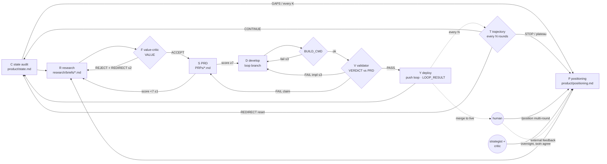

# 抽象層：一條跑不完的產品迴圈（工程可行版）

這份文件只定義「圖」——節點、產物、gate、回邊、節奏、對應的執行原語。它假設迴圈永遠不會結束：沒有終點節點，只有「停下來等人」的慢節點。後面所有檔案（commands / agents / scripts / config）都是這張圖的實作，不是另一套流程。

```
current-state audit → product positioning → product research → features → PRD
        ▲                                                                  │
        │                                                                  ▼
        └────────── deploy ◀── validate PRD ◀── develop ◀───────────────────┘
```

## 1. 三條鐵律，先於一切

1. 迴圈會最大化「gate 量得到的東西」。gate 只量正確性，它就刷出一堆能動但沒價值的邊際物（v1 在 iOS 健康 app 實跑 35 輪、31 輪是同一種指標；外部 run，本 repo 未附 log）。所以價值判斷放在建之前，正確性判斷放在建之後，兩者都是獨立 agent。
2. 判斷（latent）交給 agent，控制流（deterministic）交給腳本。driver 只 parse 每個節點吐出的一行結果，永遠不自己推理。這是它能過夜跑、能 resume、能被人審計的原因。
3. 先 discover 再 build。每輪從「現況」出發而不是從「上一輪的記憶」出發：程式碼與產品長什麼樣、哪裡壞了、離定位差多遠，是每一輪的第 0 步。

## 2. 節點定義

每個節點回答六件事：輸入產物、輸出產物、誰做、gate（誰判、判什麼、結果行）、失敗回到哪、節奏。

| # | 節點 | 輸入 | 輸出產物（檔案） | 執行者 | Gate（結果行） | 失敗回邊 | 節奏 |
|---|---|---|---|---|---|---|---|
| C | Current state 現況檢視 | repo、可跑的產物、近期 commits、（若有）指標 | `product/state.md`：有什麼／哪裡壞／離定位的差距／技術債／可量到的數字。重寫，不追加 | 輕量：本輪 agent 自己做；深度：`state-auditor`（獨立） | `AUDIT: HEALTHY \| GAPS \| BROKEN` | BROKEN → 下一輪強制維護模式（只修不加） | 輕量每輪；深度每 K 輪與每次 run 開始 |
| P | Positioning 定位 | `state.md`、外部回饋、trajectory 訊號、研究反證 | `product/positioning.md`：對象／問題／替代方案／為何是我們／北極星漏斗／category／非目標／信任規則 | 有人：`/position` 多輪 AskUserQuestion 收斂；沒人：`strategist` 提案 + `positioning-critic` 對抗，兩者同意才改 | `POSITION: APPROVED \| AGREED \| DISAGREE` | DISAGREE → 保持原定位、driver 退出等人 | 慢：每 K 輪、或收到 STOP／plateau、或 C 回報 GAPS 與定位矛盾時 |
| R | Research 研究 | positioning、state、idea ledger、近期 commits | `research/briefs/<date>-<slug>.md`：4 角度輪替、有來源的發現、一個候選 slice | researcher（`/research`） | 有候選且不撞 ledger（`RESEARCH: CANDIDATE \| NONE`） | NONE → 換角度重試 ≤1，仍 NONE → 記 LOW_IMPACT、進維護模式；被 F 拒回 R 另計 ≤2 | 每輪 |
| F | Features 功能決策 | 候選 slice + positioning | ledger 一行 + backlog 一段（category / 漏斗階段 / 假設 / size） | `value-critic`（獨立） | 價值閘：impact／novelty／effort-fit 門檻 + 信任閘（`VALUE: ACCEPT \| REJECT`） | REJECT → 帶 REDIRECT 回 R，≤2 次；仍拒 → 本輪 `REJECTED` | 每輪 |
| S | PRD 規格 | 已接受的 slice + brief | `PRPs/<date>-<feature>.md`：context、藍圖、可執行驗證指令、一句可觀察的 CLAIM。每輪必有；size 只決定深度 | architect（`/generate-prp`） | 自評信心 ≥ 7（`PRP_SCORE: n`） | < 7 → 回 R 補 context ≤1；仍 < 7 → `REJECTED` | 每輪 |
| D | Develop 開發 | PRD | 隔離分支上的一個小而局部的改動 | builder（`/execute-prp`） | 正確性閘：adapter `BUILD_CMD` exit 0（`BUILD: ok \| fail`） | fail → 修 ≤3 次 → 還原、`NOOP` | 每輪內快迴圈 |
| V | Validate PRD 驗證 | PRD（CLAIM + 成功準則）+ 改動檔 + 產物觀察 | `VERDICT` 區塊寫回 backlog | `validator`（獨立） | 對抗式驗證 CLAIM 真的成立、label 與行為一致、無 regression（`VERDICT: PASS \| PARTIAL \| FAIL`） | 實作問題 → D；CLAIM 本身不可驗／自相矛盾 → S；同 slice 超過 3 次 → 還原、`NOOP` | 每輪內快迴圈 |
| Y | Deploy 部署 | PASS 的改動 | commit + push `LOOP_BRANCH`；ledger/backlog 標 COMPLETED；`LOOP_RESULT` 一行 | 本輪 agent 跑 spec 內固定的 git 指令（driver 從不 push；`pre-push` hook 擋 live 分支） | 分支隔離：永不碰 `DEPLOY_BRANCH`；live 由人 merge | — → 回 C 開下一輪 | 每輪 |
| T | Trajectory 軌跡 | 最近 N 個 commit + positioning | — | `trajectory-monitor`（獨立） | `TRAJ: CONTINUE \| REDIRECT \| STOP` | REDIRECT → 下輪 RESET；STOP → 交回 P | 每 N 輪 |

「test or validate PRD」拆成兩層：D 後面的 `BUILD_CMD` 測「產物沒壞」（deterministic），V 測「產物兌現了 PRD 的承諾」（latent、獨立，對著 PRD 檔驗）。兩層缺一都會漏——v2 實跑有一顆按鈕 label 說「抽籤」、handler 只捲動，build 全綠、validator 也放行，是人回頭看才抓到（教訓 9）。這也是每輪都必須有 PRD 的原因：沒有 PRD，V 就沒有驗證對象，只能退化成「跑起來了」。

## 3. 圖：主流 + 回邊 + 慢節點



沒有終點。`STOP` 與 plateau 不是結束，是把控制權交回慢節點 P。P 有兩種解法：人在，就用多輪提問收斂；人不在，就讓兩個高階 agent 對抗到一致。都不成，driver 程序退出、狀態全在檔案裡、人改完 positioning 再啟動就從 C 續跑。

## 4. P 節點的兩種模式

| 模式 | 觸發 | 流程 | 能改什麼 | 落款 |
|---|---|---|---|---|
| 互動 | 人跑 `/position` | 讀 `state.md` + 最近 briefs → 每輪一個問題、2–4 個從現況推出的選項（AskUserQuestion）→ 對象 → 問題與替代方案 → 北極星漏斗與 category → 非目標與信任規則 → 摘要確認 | 全部欄位 | `approved_by: human` |
| 自主 | driver 收到 STOP／plateau 且 `AUTONOMOUS_POSITIONING=true` | `strategist`（高階模型、high effort）讀 state + 近期拒絕理由，提一份定位 delta；`positioning-critic`（同級、獨立 context）只找反證；critic 回 `AGREED` 才寫入 | 只有軟欄位：漏斗角度、category 權重、下一段要推的階段。對象／問題／信任規則是硬欄位，人專屬 | `approved_by: agents`，`pending_human_review: true`；driver 每次 run 最多做 `MAX_AUTO_POSITIONING` 次 |

兩個 agent 都不夠聰明時的保險：DISAGREE 就什麼都不改，退出等人。寧可停，不要讓定位漂。

## 5. 五種節奏（同一張圖、五個時間尺度）

| 迴圈 | 邊 | 尺度 | 誰在裡面 |
|---|---|---|---|
| 修正迴圈 | D ⇄ B ⇄ V | 分鐘 | builder + validator |
| 一輪 | C → R → F → S → D → V → Y | 10–20 分鐘 | 一個 fresh agent + 兩個獨立子代理 |
| 軌跡迴圈 | Y → T → (C 或 P) | 每 N 輪 | trajectory-monitor |
| 定位迴圈 | 深度 C → P → R | 每 K 輪或 STOP 時 | state-auditor + strategist/critic 或人 |
| 人的迴圈 | 外部回饋 → P；loop → live 的 merge | 小時到週 | 人 |

這對應 Andrew Ng 的三個 loop：agentic coding loop（修正迴圈 + 一輪）、developer feedback loop（人在 P 改 spec）、external feedback loop（真實使用者回到 P）。人的 context advantage 只在 P 注入；迴圈其他節點不等人。

## 6. 跑不完的工程條件

要讓這張圖無限跑而不爛掉，九個條件缺一不可。每一條都對應一個具體實作。

| 條件 | 為什麼 | 實作 |
|---|---|---|
| 每輪 fresh context | context 不隨輪膨脹；一輪壞掉不污染下一輪 | driver 每輪起一個 headless `claude -p` |
| 每輪從現況出發 | 記憶會漂，repo 不會 | C 節點：輕量每輪、深度每 K 輪，`state.md` 重寫不追加 |
| 狀態全部外部化 | fresh context 才能接手；人才能審計 | `product/positioning.md`、`product/state.md`、`research/briefs/`、`_idea_ledger.md`、`_product_backlog.md`、`PRPs/`、`.loop/loop.log` |
| 每個 gate 吐一行可 parse 的結果 | driver 只 parse 不推理 | `AUDIT:` / `POSITION:` / `RESEARCH:` / `VALUE:` / `PRP_SCORE:` / `BUILD:` / `VERDICT:` / `TRAJ:` / `LOOP_RESULT:` |
| 每條回邊有上限 | 一輪必須在有限時間內結束，無限的是外圈不是內圈 | 研究換角度 ≤1、價值閘拒回 R ≤2、PRD 重寫 ≤1、修 ≤3、驗 ≤3；超過 → 還原 + `NOOP` |
| 去重集合 = 看過的一切 | 被拒的想法會每輪復活，迴圈永不收斂 | ledger 記 COMPLETED/IN_PROGRESS/FAILED/REJECTED/LOW_IMPACT 全部狀態；F 之前先查 |
| 部署隔離 | 跑不完 = 一定會出錯；錯不能上 live | driver 開頭硬擋非 `LOOP_BRANCH`；只 push loop；live 由人 merge |
| 停機條件是「交回 P」不是「結束」 | 拒絕率飆高、軌跡漂移代表定位需要重看，不代表沒事做 | plateau（滾動拒絕率 ≥ 0.6）、連續 RESET 仍拒、trajectory STOP、預算上限 → P（自主或等人） |
| 可 resume | 半夜當掉不能從頭來 | ledger 裡的 `[IN_PROGRESS]` 是 checkpoint；下一輪 C 步驟先處理它（續做或標 FAILED） |

## 7. Latent vs deterministic：每個節點用什麼原語

| 節點 | 原語 | 性質 |
|---|---|---|
| C | 輕量：spec 內固定指令；深度：`.claude/agents/state-auditor.md` → `product/state.md` | deterministic 觀察 + latent 判讀 |
| P | `/position`（AskUserQuestion 多輪）或 `strategist` + `positioning-critic` 子代理 → `product/positioning.md` | latent + human |
| R | `/research` slash command → brief 檔 | latent |
| F | `.claude/agents/value-critic.md` 子代理 | latent 判斷、deterministic parse |
| S | `/generate-prp` → `PRPs/*.md` | latent |
| D | `/execute-prp` | latent |
| B | `scripts/adapters/*`（`BUILD_CMD`） | deterministic |
| V | `.claude/agents/validator.md` 子代理，對著 PRD 檔驗 | latent（對著 deterministic 的截圖／輸出） |
| Y | git 指令（spec 內固定） | deterministic |
| T | `.claude/agents/trajectory-monitor.md` | latent |
| driver | `scripts/run-loop.sh` + `loop.config.env` | deterministic |

只有 adapter（B 怎麼 build、怎麼觀察、什麼算壞）隨產品變；其餘節點、gate、回邊、協定全部照用。iOS（健康 app，外部 run，本 repo 未附 log）與 web（v2 測試場，log 在 `examples/`）兩個 adapter 都實跑過（N=2），才敢抽這層。

## 8. 結果行協定（driver 唯一讀的東西）

```
AUDIT:       HEALTHY | GAPS | BROKEN
POSITION:    APPROVED | AGREED | DISAGREE
RESEARCH:    CANDIDATE | NONE
VALUE:       ACCEPT | REJECT          （+ CATEGORY / FUNNEL_STEP / SCORES / REDIRECT）
PRP_SCORE:   <1-10>
BUILD:       ok | fail
VERDICT:     PASS | PARTIAL | FAIL    （+ CLAIM / EVIDENCE / SCORECARD / BLOCKERS）
TRAJ:        CONTINUE | REDIRECT | STOP
LOOP_RESULT: SHIPPED | category=<c> | step=<s> | rejects=<N>
LOOP_RESULT: REJECTED | rejects=<N>
LOOP_RESULT: NOOP | rejects=<N>
```

`rejects=N` 每輪必帶（0 也寫）。driver 用它算滾動拒絕率；沒有它 plateau 偵測是瞎的（v2 的實際教訓：只看「整輪全拒」，20 輪內 17 個被拒想法一個都沒接到訊號；而且即使用 v2.1 的拒絕率規則，那筆資料也不會觸發——plateau 規則至今沒有真實正例，見教訓 2 與 10）。

## 9. 這張圖刻意不做的事

- 不讓 agent 決定「要不要停」——停機條件全在 driver 裡，用數字。
- 不讓 builder 判自己的價值或正確性。
- 不讓 agent 改定位的硬欄位（對象／問題／信任規則）。
- 不自動 merge 到 live。
- 不在 vault／repo 裡維護另一份 task list——ledger 與 backlog 是迴圈的工作記憶，不是任務系統。
- 不從 N=1 抽框架。

## 下一層

- 節點怎麼做：[01-state-and-positioning](01-state-and-positioning.md) → [02-research](02-research.md) → [03-prd](03-prd.md) → [04-dev-and-validate](04-dev-and-validate.md)
- driver 與停機：[05-loop](05-loop.md)
- 十條硬教訓與 v1→v2→v2.1 的數字：[06-lessons](06-lessons.md)
- 換產品只換 adapter：[07-adapters](07-adapters.md)；五步裝進你的 repo：[08-adopt](08-adopt.md)
- 真實實跑：`examples/web-v2-20-rounds/`（v2）與 `examples/ios-v1-112-iterations/`（v1 對照）
