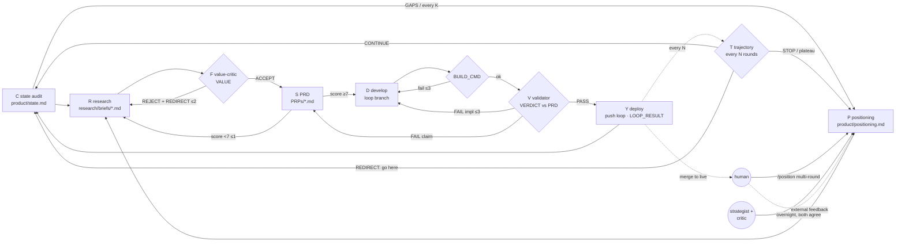

# The abstraction: a product loop that never ends (the buildable version)

This document defines only the graph: nodes, artifacts, gates, back-edges, cadence, and the execution primitive behind each node. It assumes the loop never ends. There is no terminal node, only a slow node where the loop stops and waits for a human. Everything else in the repo (commands, agents, scripts, config) implements this graph; none of it is a separate process.

```
current-state audit → product positioning → product research → features → PRD
        ▲                                                                  │
        │                                                                  ▼
        └────────── deploy ◀── validate PRD ◀── develop ◀───────────────────┘
```

## 1. Three rules that come before everything else

1. **A loop maximizes whatever its gates measure.** If the only gate measures correctness, the loop churns out things that work and are worth nothing (v1, on an iOS health app, ran 35 rounds; 31 of them added the same kind of metric — an external run, logs not included here). So value is judged *before* building and correctness *after*, each by an independent agent.
2. **Judgment (latent) goes to agents; control flow (deterministic) goes to scripts.** The driver only parses the one result line each node prints. It never reasons. That is why it can run overnight, resume, and be audited by a human.
3. **Discover before you build.** Every round starts from the *current state*, not from the previous round's memory: what the code and the product look like, what is broken, how far it is from the positioning. That is step 0 of every round.

## 2. Nodes

Each node answers six questions: input artifacts, output artifacts, who does it, the gate (who judges what, and the result line), where a failure goes back to, and cadence.

| # | Node | Input | Output artifact (file) | Performed by | Gate (result line) | Failure back-edge | Cadence |
|---|---|---|---|---|---|---|---|
| C | Current state | repo, a runnable product, recent commits, metrics if any | `product/state.md`: what exists / what is broken / gap vs positioning / tech debt / measurable numbers. Rewritten, never appended | Light: the round agent; deep: `state-auditor` (independent) | `AUDIT: HEALTHY \| GAPS \| BROKEN` | BROKEN → next round is forced into maintenance mode (fix only, add nothing) | Light every round; deep every K rounds and at the start of every run |
| P | Positioning | `state.md`, external feedback, trajectory signal, contrary research | `product/positioning.md`: target user / problem / alternatives / why us / north-star funnel / categories / non-goals / trust rules | With a human: `/position` converges over multiple AskUserQuestion rounds; without: `strategist` proposes, `positioning-critic` attacks, changed only if both agree | `POSITION: APPROVED \| AGREED \| DISAGREE` | DISAGREE → keep the current positioning; the driver exits and waits for a human | Slow: every K rounds, on STOP/plateau, or when C reports GAPS that contradict the positioning |
| R | Research | positioning, state, idea ledger, recent commits | `research/briefs/<date>-<slug>.md`: one of 4 rotating angles, sourced findings, one candidate slice | researcher (`/research`) | A candidate that does not collide with the ledger (`RESEARCH: CANDIDATE \| NONE`) | NONE → retry with another angle ≤1; still NONE → log LOW_IMPACT, enter maintenance mode. Rejections from F back to R are counted separately, ≤2 | Every round |
| F | Features (decision) | candidate slice + positioning | one ledger line + one backlog section (category / funnel stage / hypothesis / size) | `value-critic` (independent) | Value gate: impact / novelty / effort-fit thresholds + trust gate (`VALUE: ACCEPT \| REJECT`) | REJECT → back to R with a REDIRECT, ≤2 times; still rejected → round ends `REJECTED` | Every round |
| S | PRD | accepted slice + brief | `PRPs/<date>-<feature>.md`: context, blueprint, executable validation commands, one observable CLAIM. Required every round; size only sets the depth | architect (`/generate-prp`) | Self-assessed confidence ≥ 7 (`PRP_SCORE: n`) | < 7 → back to R for more context ≤1; still < 7 → `REJECTED` | Every round |
| D | Develop | PRD | one small, localized change on an isolated branch | builder (`/execute-prp`) | Correctness gate: the adapter's `BUILD_CMD` exits 0 (`BUILD: ok \| fail`) | fail → fix ≤3 times → revert, `NOOP` | Fast inner loop |
| V | Validate PRD | PRD (CLAIM + success criteria) + changed files + observation of the product | a `VERDICT` block written back to the backlog | `validator` (independent) | Adversarially verifies the CLAIM holds, labels match behavior, no regressions (`VERDICT: PASS \| PARTIAL \| FAIL`) | Implementation issue → D; the CLAIM itself unobservable or contradictory → S; more than 3 tries on one slice → revert, `NOOP` | Fast inner loop |
| Y | Deploy | the PASSed change | commit + push `LOOP_BRANCH`; ledger/backlog marked COMPLETED; one `LOOP_RESULT` line | the round agent runs fixed git commands from the spec (the driver never pushes; a `pre-push` hook blocks the live branch) | Branch isolation: never touches `DEPLOY_BRANCH`; a human merges to live | — → back to C for the next round | Every round |
| T | Trajectory | last N commits + positioning | — | `trajectory-monitor` (independent) | `TRAJ: CONTINUE \| REDIRECT \| STOP` | REDIRECT → its whole line goes into the next round's prompt as the direction to take; STOP → hand to P | Every N rounds |

"Test or validate the PRD" is split into two layers. `BUILD_CMD` after D tests that *the product is not broken* (deterministic). V tests that *the product delivers what the PRD promised* (latent, independent, checked against the PRD file). Drop either layer and things slip through: in the v2 run a button labeled "draw a fortune" only scrolled the page, the build was green, the validator passed it, and only a human looking afterwards caught it (lesson 9). It is also why every round needs a PRD: without one, V has nothing to verify against and degrades to "it runs".

## 3. The graph: main flow, back-edges, slow node


```mermaid
flowchart LR
  C[C state audit<br/>product/state.md]
  P[P positioning<br/>product/positioning.md]
  R[R research<br/>research/briefs/*.md]
  F{F value-critic<br/>VALUE}
  S[S PRD<br/>PRPs/*.md]
  D[D develop<br/>loop branch]
  B{BUILD_CMD}
  V{V validator<br/>VERDICT vs PRD}
  Y[Y deploy<br/>push loop · LOOP_RESULT]
  T{T trajectory<br/>every N rounds}
  H((human))
  A2((strategist +<br/>critic))

  C --> R
  C -- GAPS / every K --> P
  P --> R
  R --> F
  F -- ACCEPT --> S
  F -- REJECT + REDIRECT ≤2 --> R
  S -- score ≥7 --> D
  S -- score <7 ≤1 --> R
  D --> B
  B -- ok --> V
  B -- fail ≤3 --> D
  V -- PASS --> Y
  V -- FAIL impl ≤3 --> D
  V -- FAIL claim --> S
  Y --> C
  Y -. every N .-> T
  T -- CONTINUE --> C
  T -- REDIRECT: go here --> C
  T -- STOP / plateau --> P
  H -- /position multi-round --> P
  A2 -- overnight, both agree --> P
  H -. external feedback .-> P
  Y -. merge to live .-> H
```

There is no end. `STOP` and plateau are not the end; they hand control back to the slow node P. P has two ways to resolve: if a human is present, converge through multi-round questions; if not, let two senior agents argue until they agree. If neither works, the driver process exits, all state is in files, and once a human edits the positioning the loop restarts from C.

## 4. The two modes of node P

| Mode | Trigger | Flow | What it may change | Signed as |
|---|---|---|---|---|
| Interactive | A human runs `/position` | Read `state.md` + recent briefs → one question per round with 2–4 options derived from the current state (AskUserQuestion) → target user → problem and alternatives → north-star funnel and categories → non-goals and trust rules → confirm a summary | Every field | `approved_by: human` |
| Autonomous | The driver hits STOP/plateau and `AUTONOMOUS_POSITIONING=true` | `strategist` (senior model, high effort) reads state + recent rejection reasons and proposes one positioning delta; `positioning-critic` (same tier, independent context) looks only for counter-evidence; written only when the critic returns `AGREED` | Soft fields only: funnel angle, category weights, the next stage to push. Target user / problem / trust rules are hard fields, human only | `approved_by: agents`, `pending_human_review: true`; at most `MAX_AUTO_POSITIONING` times per run |

The safeguard for when neither agent is smart enough: on DISAGREE nothing changes and the driver exits to wait for a human. Stopping is better than letting the positioning drift.

## 5. Five cadences (one graph, five time scales)

| Loop | Edges | Scale | Who is in it |
|---|---|---|---|
| Fix loop | D ⇄ B ⇄ V | minutes | builder + validator |
| One round | C → R → F → S → D → V → Y | 10–20 minutes | one fresh agent + two independent subagents |
| Trajectory loop | Y → T → (C or P) | every N rounds | trajectory-monitor |
| Positioning loop | deep C → P → R | every K rounds or on STOP | state-auditor + strategist/critic, or a human |
| Human loop | external feedback → P; merges from loop to live | hours to weeks | a human |

This maps onto Andrew Ng's three loops: the agentic coding loop (fix loop + one round), the developer feedback loop (a human editing the spec at P), and the external feedback loop (real users feeding back into P). A human's context advantage is injected only at P; no other node waits for a human.

## 6. The engineering conditions for a loop that never ends

For this graph to run indefinitely without rotting, all nine conditions are required. Each maps to a concrete implementation.

| Condition | Why | Implementation |
|---|---|---|
| Fresh context every round | Context does not grow with rounds; a broken round does not contaminate the next | The driver starts one headless `claude -p` per round |
| Every round starts from the current state | Memory drifts; the repo does not | Node C: light every round, deep every K rounds; `state.md` rewritten, never appended |
| All state is externalized | A fresh context can take over; a human can audit | `product/positioning.md`, `product/state.md`, `research/briefs/`, `_idea_ledger.md`, `_product_backlog.md`, `PRPs/`, `.loop/loop.log`, `.loop/gates.jsonl` |
| Every gate prints one parseable result line | The driver parses and never reasons | `AUDIT:` / `POSITION:` / `RESEARCH:` / `VALUE:` / `PRP_SCORE:` / `BUILD:` / `VERDICT:` / `TRAJ:` / `LOOP_RESULT:` |
| Every back-edge has a cap | A round must end in bounded time; the outer loop is infinite, the inner one is not | Research angle retry ≤1, value-gate rejection back to R ≤2, PRD rewrite ≤1, fix ≤3, validate ≤3; beyond that → revert + `NOOP` |
| The dedup set = everything ever seen | Rejected ideas resurrect every round and the loop never converges | The ledger keeps every status: COMPLETED/IN_PROGRESS/FAILED/REJECTED/LOW_IMPACT; checked before F |
| Deploy isolation | A loop that never ends will make mistakes; mistakes must not reach live | The driver refuses anything but `LOOP_BRANCH`; only the loop branch is pushed; a human merges to live |
| A stop means "hand to P", not "finish" | A high rejection rate or trajectory drift means the positioning needs another look, not that there is nothing left to do | plateau (rolling rejection rate ≥ 0.6), a RESET round still fully rejected, trajectory STOP, budget cap → P (autonomous or wait for a human) |
| Resumable | A crash at 3 a.m. must not restart from zero | `[IN_PROGRESS]` in the ledger is the checkpoint; the next round's C step handles it first (resume or mark FAILED) |

## 7. Latent vs deterministic: the primitive behind each node

| Node | Primitive | Nature |
|---|---|---|
| C | Light: fixed commands in the spec; deep: `.claude/agents/state-auditor.md` → `product/state.md` | deterministic observation + latent reading |
| P | `/position` (multi-round AskUserQuestion) or the `strategist` + `positioning-critic` subagents → `product/positioning.md` | latent + human |
| R | `/research` slash command → a brief file | latent |
| F | `.claude/agents/value-critic.md` subagent | latent judgment, deterministic parse |
| S | `/generate-prp` → `PRPs/*.md` | latent |
| D | `/execute-prp` | latent |
| B | `scripts/adapters/*` (`BUILD_CMD`) | deterministic |
| V | `.claude/agents/validator.md` subagent, checked against the PRD file | latent (over a deterministic screenshot / output) |
| Y | git commands (fixed in the spec) | deterministic |
| T | `.claude/agents/trajectory-monitor.md` | latent |
| driver | `scripts/run-loop.sh` + `loop.config.env` | deterministic |
| (optional) Jev pre-checks | `scripts/jev/jev.mjs`: before F, inside V, R's pick, the driver's early T trigger, a re-validation trigger after V, a retry check in the fix loops, and an early-audit trigger after a NOOP; can only fast-reject, never approve ([09-jev](09-jev.md)) | latent (a typed judgment, not generation), deterministic parse |

Only the adapter (how B builds, observes, and decides "broken") changes per product; every other node, gate, back-edge and the protocol is reused as-is. Both adapters, iOS (a health app, external run, logs not included) and web (the v2 test site, logs in `examples/`), have run for real (N=2). That is the minimum before abstracting this layer.

## 8. The result-line protocol (the only thing the driver reads)

```
AUDIT:       HEALTHY | GAPS | BROKEN
POSITION:    APPROVED | AGREED | DISAGREE
RESEARCH:    CANDIDATE | NONE
VALUE:       ACCEPT | REJECT          (+ CATEGORY / FUNNEL_STEP / SCORES / REDIRECT)
PRP_SCORE:   <1-10>
BUILD:       ok | fail
VERDICT:     PASS | PARTIAL | FAIL    (+ CLAIM / EVIDENCE / SCORECARD / BLOCKERS)
TRAJ:        CONTINUE | REDIRECT | STOP
LOOP_RESULT: SHIPPED | category=<c> | step=<s> | rejects=<N>
LOOP_RESULT: REJECTED | rejects=<N>
LOOP_RESULT: NOOP | rejects=<N>
JEV:         OFF | SHADOW | PASS | ESCALATE | UNAVAILABLE | REJECT | SAME | DISTINCT | MISMATCH | PICK <key> | UNSUPPORTED | CONTRADICTED | SAME_FAILURE | AUDIT_NOW | NO_TRIGGER   (optional, 09-jev)
```

`rejects=N` is required on every line, 0 included. The driver computes the rolling rejection rate from it; without it plateau detection is blind. The real lesson from v2: watching only for "a fully rejected round", none of the 17 ideas rejected across 20 rounds produced a signal. Even under the v2.1 rejection-rate rule that data would not trigger; the plateau rule still has no real positive case (lessons 2 and 10).

The driver reads only these lines, but with `jq` installed it also records every gate decision in full (report, verdict, evidence) to `.loop/gates.jsonl` — see [05-loop](05-loop.md#gate-records-loopgatesjsonl).

## 9. What this graph deliberately does not do

- Let an agent decide whether to stop. Every stop condition lives in the driver, as a number.
- Let the builder judge its own value or correctness.
- Let an agent change the hard fields of the positioning (target user / problem / trust rules).
- Merge to live automatically.
- Maintain a separate task list in a vault or the repo. The ledger and backlog are the loop's working memory, not a task system.
- Abstract a framework from N=1.

## Next

- How each node works: [01-state-and-positioning](01-state-and-positioning.md) → [02-research](02-research.md) → [03-prd](03-prd.md) → [04-dev-and-validate](04-dev-and-validate.md)
- The driver and stopping: [05-loop](05-loop.md)
- Seventeen hard lessons, from v1 to the first live adoption: [06-lessons](06-lessons.md)
- Change products by changing the adapter: [07-adapters](07-adapters.md); install into your repo in five steps: [08-adopt](08-adopt.md)
- Optional: fast-reject with Jev in front of the LLM gates: [09-jev](09-jev.md)
- Measure a change against a baseline: [11-eval](11-eval.md)
- See what the loop is doing: [10-dashboard](10-dashboard.md) (`events.jsonl` is written by the driver and `scripts/loop-event.sh`; it is not a result line and no gate reads it)
- Real runs: `examples/web-v2-20-rounds/` (v2) and `examples/ios-v1-112-iterations/` (the v1 contrast)
