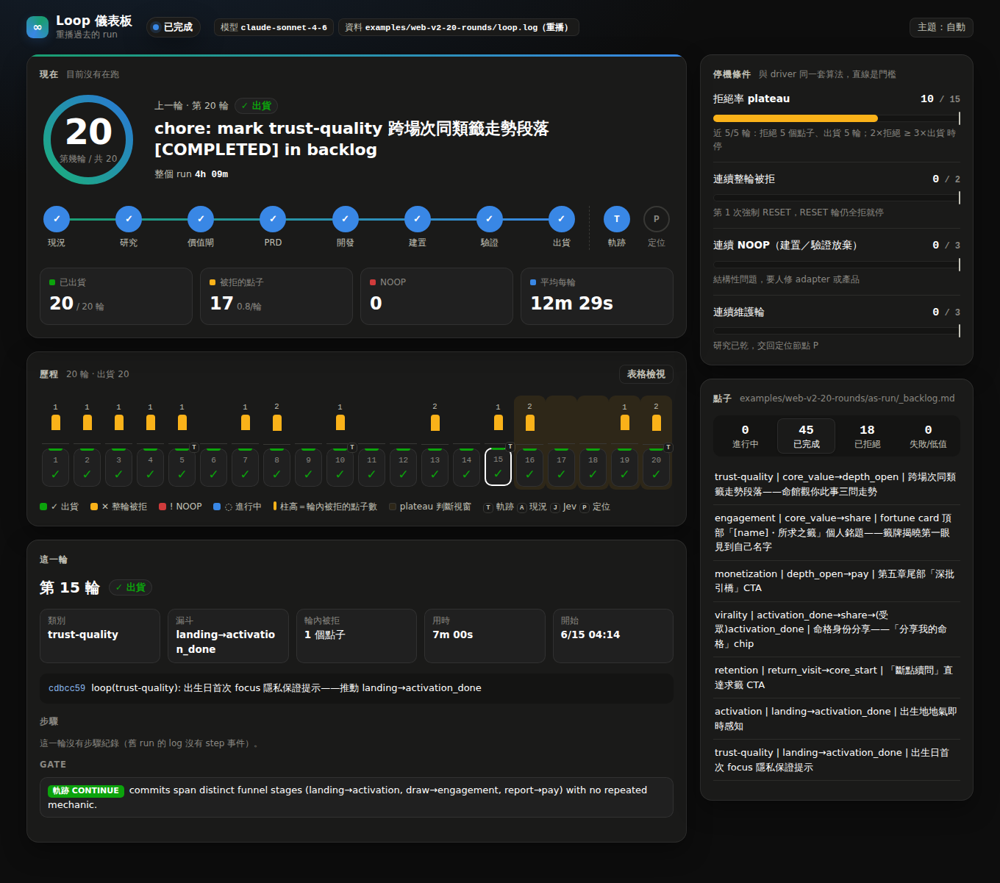

# 10 開發者 Dashboard：歷程、現在在做什麼、走到哪

一個本機、唯讀的網頁。它只讀 loop 本來就會寫的檔案，不會啟動、停止或改變 loop 的任何決定。

```bash
node scripts/dashboard/serve.mjs            # 開 http://127.0.0.1:4400 ，每 3 秒更新
```


## 畫面上有什麼

| 區塊 | 回答的問題 | 資料來源 |
|---|---|---|
| 狀態膠囊 + 橫幅 | 在跑嗎？停下來了嗎？為什麼？ | `.loop/run.pid`（程序還活著嗎）、`.loop/state`（`WAITING_FOR_P`）、`stop` / `park` / `done` 事件 |
| 現在 | 第幾輪、在 C→R→F→S→D→B→V→Y 哪一步、這一步做了多久；driver 在跑 T／P／深度 C 時也會亮 | `events.jsonl` 的 `round_start` 與 `step`、`*_start` |
| 歷程 | 每一輪的結果（✓ 出貨／✕ 整輪被拒／! NOOP）、輪內被拒幾個點子、哪幾輪有 gate 事件（T／A／J／P，紅黃代表 STOP／REDIRECT 等） | `round_end`、`traj`、`audit`、`jev_same`、`position` |
| 第 N 輪 | 類別、漏斗、commit、每一步的時間線、gate 的原文、這輪的 PRP／brief／round log | 同上，加上 `git show --name-only <commit>` |
| 停機條件 | 離 driver 的四個停機門檻還有多遠 | 由事件重算，**跟 `scripts/run-loop.sh` 同一套規則**（測試逐條對照） |
| 點子 | ledger 裡每個點子的狀態，Jev 快速拒絕另外標示 | `LEDGER`（預設 `.claude/tasks/_idea_ledger.md`） |
| Jev | 最近 30 次 Jev 呼叫 | `.loop/jev.jsonl`（`JEV_MODE` 不是 off 時才出現） |

設計上，每個視覺元素都要多帶一點資訊：
- **進度環**：已跑完幾輪／總輪數。
- **軌道**：這一輪走到哪，正在做的那一段會流動。
- **每輪上方的柱子**：輪內被拒的點子數，黃色底帶標出 plateau 的判斷視窗，看得出為什麼快停了。
- **步驟耗時條**：哪一步最花時間。
- **meter 上的直線**：停機門檻的位置。

每個有顏色的狀態都附圖示和文字，不只靠顏色。歷程可以切成表格檢視。深淺色跟著系統，也可以手動切換（只存在瀏覽器本機）。

## 「現在在哪一步」怎麼來的

driver 只看得到一輪的開始與結束：每一輪是一個 `claude -p`，跑完才輸出，中途的 `round-NNN.log` 是空的。所以 spec 加了一條規則（`innovation_loop.md` 的 Progress events）：round agent 每進入一步，先跑

```bash
scripts/loop-event.sh step <C|R|F|S|D|B|V|Y|M> "<一句話：在做什麼、哪個 slice>"
```

它把一行 JSON 附加到 `.loop/events.jsonl`，driver 用同一支腳本寫 run／round／gate 事件（driver export 了 `LOOP_ROUND` 和 `LOOP_EVENTS`，所以 agent 不用自己知道輪次）。這不是結果行：沒有任何 gate 或停機條件讀它，寫失敗也不會影響這一輪。舊版 spec 的 agent 不會回報步驟，畫面會顯示「round agent 還沒回報步驟」，其他區塊照常。

## 重播過去的 run

沒有 `events.jsonl` 的舊 run（例如 web-v2）會自動改讀 `loop.log`：

```bash
node scripts/dashboard/serve.mjs --loop-log examples/web-v2-20-rounds/loop.log \
     --ledger examples/web-v2-20-rounds/as-run/_backlog.md
```



重播時模型、分支、Jev 模式都取自那份 log 本身，不會拿今天的 `loop.config.env` 補。舊 log 沒有步驟事件，所以只有結果、沒有步驟時間線。

## 安全與限制

- 只綁 `127.0.0.1`，只接受 GET。round log 可能有任何內容，不要把這個 port 開到外面。
- 檔案檢視走白名單：`PRPs/*.md`、`research/briefs/*.md`、`product/state.md`、`product/positioning.md`、`.loop/{round,audit,traj,position}-NNN.log`。其他路徑一律 403（含 `..` 與 `loop.config.env`）。
- 沒有相依套件，Node 18 以上即可。資料在跑 loop 的那台機器上，所以這是本機工具，不是線上頁面。
- 停機條件是**重算**的，不是 driver 的內部狀態。兩者規則相同、有測試對照，但 driver 才是唯一會停機的地方。

## 測試

```bash
node scripts/dashboard/test/state.test.mjs   # 重播數字對 README、執行中／中斷／停下等人、停機規則、server 白名單
bash scripts/test-driver.sh                  # 劇本 4：真的 driver 寫出的事件 → dashboard 讀到同樣的結果
node scripts/dashboard/test/fixture.mjs /tmp/x && node scripts/dashboard/serve.mjs --root /tmp/x   # 看一個跑到一半的假 run
```

下一頁：回到 [00-pipeline](00-pipeline.md)
